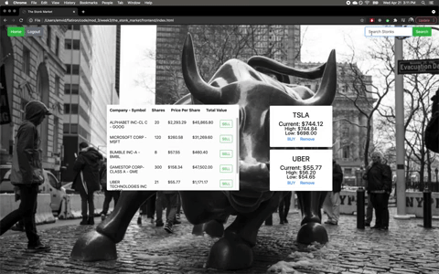
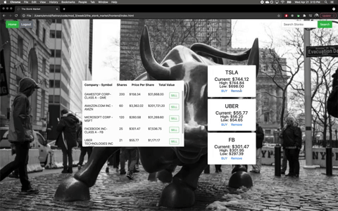

# README

---
## The Stonk Market

The Stonk Market is a lightweight "stock" trading platform that allows users to search any company listed on the NYSE and either follow that company or purchase "shares" in that company.

--- 
## Motivation

The motivation for this project came from the desire to challenge ourselves. My partner and I both find personal finance/investing fascinating and wanted to push ourselves to work with an API for the first time. The end product is a fake trading platform that uses real companies and realtime stock prices.

---
## Technology

* Frontend - Vanilla JavaScript
* Backend - Ruby on Rails
* Finnhub API
* Styling - Bootstrap

---
## Features

* Finnhub API pulls each company listed on NYSE
* Users can search companies by name or symbol
* Real time stock prices are provided by Finnhub
* Ability to "purchase" stocks or follow companies

---
## Demo

Full Demo: https://youtu.be/RWDCteLRaik

Search:

Follow and Purchase: 

Sell: 

Unfollow:

